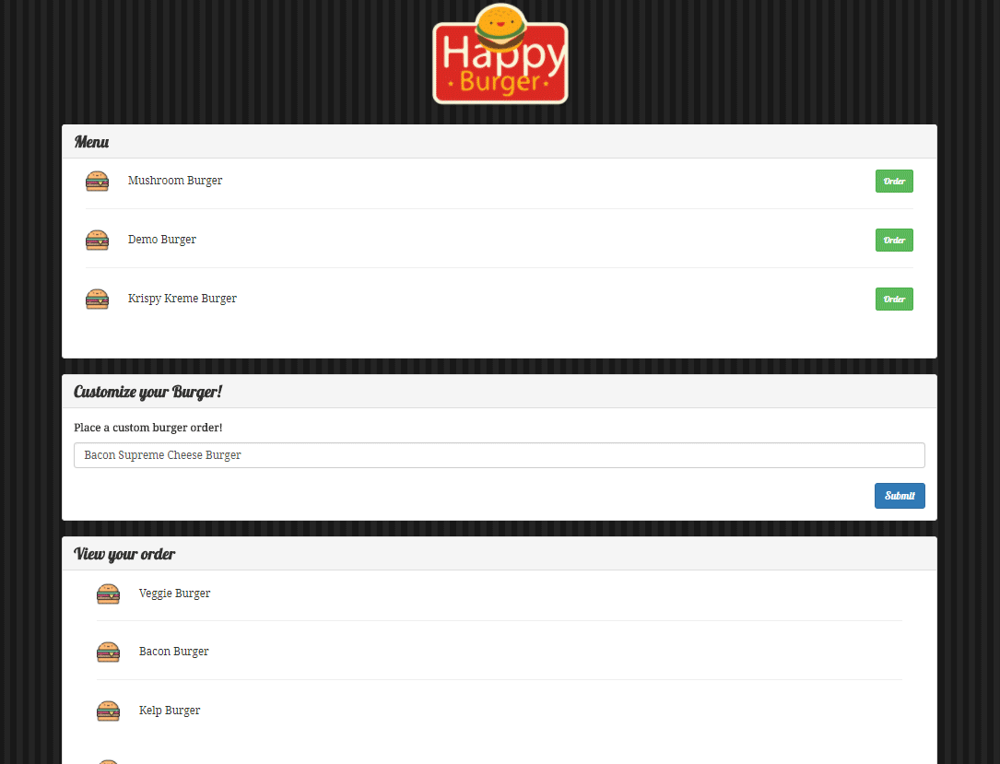

# Burger Menu Ordering Application
This application allows the user to interact with a mock resturant ordering system. Select from previously created menu items or create your own menu items and submit the data for order.

#### This web application was created with the following technologies:
* Express
* MYSQL
* Handlebars
* Method-Override
* Body Parser

